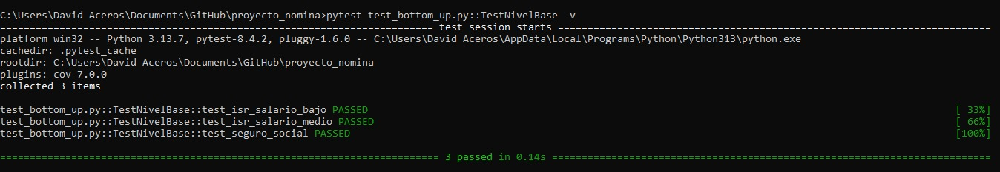
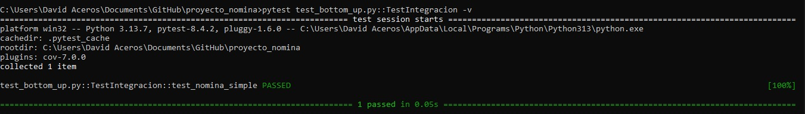
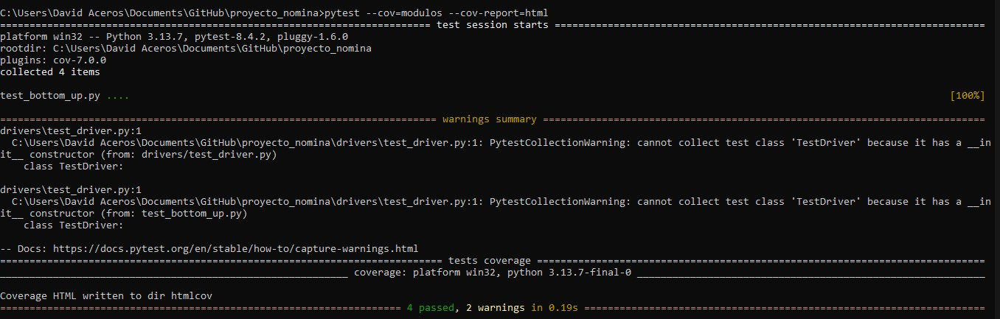

# 💼 Payroll_Project_BottomUp_Testing_David_Aceros

<p align="center">
  
</p>

This project implements and tests a **Payroll System** developed in **Python**, using a **Bottom-Up Testing** approach with **test drivers**.  
The process starts by validating **base modules** (taxes, bonuses, and deductions calculators) and then integrates them into the complete system (`NominaSistema`).

---

## 🖥️ Language and Version
- 🐍 **Language:** Python  
- 📌 **Recommended version:** 3.10 or higher  

---

## ⚙️ Installation

1. Clone or download this repository.  
2. Install the required dependencies:  

pip install pytest pytest-cov


proyecto_nomina/
├── modulos/
│   ├── __init__.py
│   ├── calculadora_impuestos.py   # Base module: ISR & Social Security
│   ├── calculadora_bonos.py       # Base module: bonuses
│   └── calculadora_deducciones.py # Base module: deductions
├── drivers/
│   ├── __init__.py
│   └── test_driver.py             # Driver for unit tests
├── nomina_sistema.py              # Integrated system
└── test_bottom_up.py              # Unit and integration tests


Level 1: Test base modules
pytest "test_bottom_up.py::TestNivelBase" -v

Level 2: Test integration
pytest "test_bottom_up.py::TestIntegracion" -v

Full coverage
pytest --cov=modulos --cov-report=html
start htmlcov\index.html   # Open report on Windows


=================== test session starts ===================
test_bottom_up.py::TestNivelBase::test_isr_low_salary PASSED
test_bottom_up.py::TestNivelBase::test_isr_medium_salary PASSED
test_bottom_up.py::TestNivelBase::test_social_security PASSED
test_bottom_up.py::TestIntegracion::test_simple_payroll PASSED


📝 Fixes and Improvements

🔧 Added calculadora_bonos.py and calculadora_deducciones.py modules.
🔧 Fixed imports in nomina_sistema.py.
🔧 Adjusted pytest execution for Windows with quotes.
🧪 Added integration tests (TestIntegracion).
🏃 Automated coverage execution with pytest-cov.

📸 Test Execution Evidence
✅ Level 1 - Base module tests
<p align="center">  </p>
✅ Level 2 - Integration tests
<p align="center">  </p>
✅ Coverage Report
<p align="center">  </p> ```